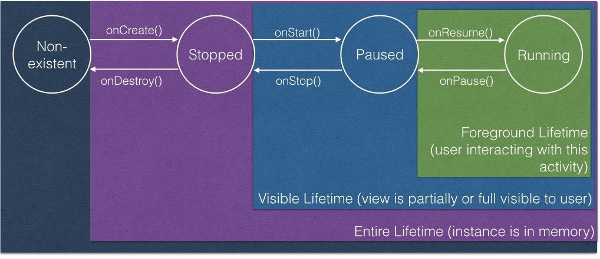
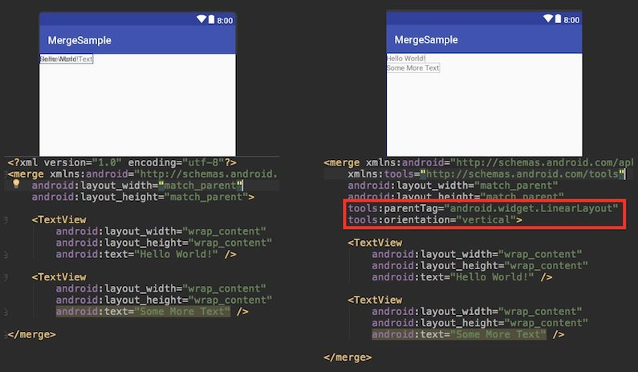

### Show some :heart: and star the repo to support the project
[](https://github.com/nisrulz/android-tips-tricks) [](https://github.com/nisrulz/android-tips-tricks/fork) [](https://github.com/nisrulz/android-tips-tricks) [](https://github.com/nisrulz/android-tips-tricks)  
[](https://twitter.com/nisrulz)

### Featured in
[](http://androidweekly.net/issues/issue-221) [](https://www.androiddevdigest.com/digest-110/) [](https://github.com/JStumpp/awesome-android#resources)

**Also included in**
+ [Awesome Android Newsletter #Issue 16](https://android.libhunt.com/newsletter/16)

Cheatsheet about tips and tricks for Android Development

This is a simple set of tips and tricks regarding Android Development which I have gathered from various sources. It helps me direct other android devs in my community regarding stuff each android dev should know about. It is also there for me to keep track of anything I either learn on my own or from other sources now and then when browsing the internet.

Contributions are always welcome, hoping people will help me in growing this. To contribute, simply open up a PR with the changes.


## Index

* [Know Your Tools](#know-your-tools)
    * [Android Studio](#android-studio)
    * [Emulator](#emulator)
    * [Vysor](#vysor)
    * [DeskDock](#deskdock)
    * [ADB Shell](#adb-shell)
* [Make better choices while coding](#make-better-choices-while-coding)
* [Tips regarding UI/UX](#tips-regarding-uiux)
* [Tips if you use Kotlin](#tips-if-you-use-kotlin)
* [Extra : Android Libraries built by me](#extra--android-libraries-built-by-me)
* [Translations](#translations)

### ***Know Your Tools***
#### ***Android Studio***

+ **Code faster by using keyboard shortcuts**

  |Description                                                                      |Mac                                                        |Linux/Win
  |---------------------------------------------------------------------------------|-----------------------------------------------------------|----------------------------
  |Lookup IDE commands / Actions                                                    |<kbd>Cmd</kbd>&nbsp;<kbd>Shift</kbd>&nbsp;<kbd>A</kbd>                 |<kbd>Ctrl</kbd>&nbsp;<kbd>Shift</kbd>&nbsp;<kbd>A</kbd>
  |Open Class                                                                       |<kbd>Cmd</kbd>&nbsp;<kbd>O</kbd>                                 |<kbd>Ctrl</kbd>&nbsp;<kbd>O</kbd>
  |Open File                                                                        |<kbd>Cmd</kbd>&nbsp;<kbd>Shift</kbd>&nbsp;<kbd>O</kbd>                 |<kbd>Ctrl</kbd>&nbsp;<kbd>Shift</kbd>&nbsp;<kbd>N</kbd>
  |Open recently edited file                                                        |<kbd>Cmd</kbd>&nbsp;<kbd>Shift</kbd>&nbsp;<kbd>E</kbd>                 |<kbd>Ctrl</kbd>&nbsp;<kbd>Shift</kbd>&nbsp;<kbd>E</kbd>
  |Open Symbol                                                                      |<kbd>Cmd</kbd>&nbsp;<kbd>Opt</kbd>&nbsp;<kbd>O</kbd>                   |<kbd>Alt</kbd>&nbsp;<kbd>Shift</kbd>&nbsp;<kbd>N</kbd>
  |Open recently used file                                                          |<kbd>Cmd</kbd>&nbsp;<kbd>E</kbd>                                 |<kbd>Ctrl</kbd>&nbsp;<kbd>E</kbd>
  |Last Edited Location                                                             |<kbd>Cmd</kbd>&nbsp;<kbd>Shift</kbd>&nbsp;<kbd>Backspace</kbd>         |<kbd>Ctrl</kbd>&nbsp;<kbd>Shift</kbd>&nbsp;<kbd>Backspace</kbd>
  |Find Usage in persistent window                                                  |<kbd>Opt</kbd>&nbsp;<kbd>F7</kbd>                                |<kbd>Alt</kbd>&nbsp;<kbd>F7</kbd>
  |Find Usage in floating window                                                    |<kbd>Cmd</kbd>&nbsp;<kbd>Opt</kbd>&nbsp;<kbd>F7</kbd>                  |<kbd>Ctrl</kbd>&nbsp;<kbd>Alt</kbd>&nbsp;<kbd>F7</kbd>
  |Format the code with proper Indentation                                          |<kbd>Cmd</kbd>&nbsp;<kbd>Opt</kbd>&nbsp;<kbd>L</kbd>                   |<kbd>Ctrl</kbd>&nbsp;<kbd>Alt</kbd>&nbsp;<kbd>L</kbd>
  |Surround With                                                                    |<kbd>Opt</kbd>&nbsp;<kbd>Cmd</kbd>&nbsp;<kbd>T</kbd>                   |<kbd>Alt</kbd>&nbsp;<kbd>Ctrl</kbd>&nbsp;<kbd>T</kbd>
  |Open Terminal                                                                    |<kbd>Opt</kbd>&nbsp;<kbd>F12</kbd>                               |<kbd>Alt</kbd>&nbsp;<kbd>F12</kbd>
  |Generate Setter/Getters                                                          |<kbd>Cmd</kbd>&nbsp;<kbd>N</kbd>                                 |<kbd>Alt</kbd>&nbsp;<kbd>Ins</kbd>
  |Find Class                                                                       |<kbd>CMD</kbd>&nbsp;<kbd>O</kbd>                                 |<kbd>Ctrl</kbd>&nbsp;<kbd>N</kbd>
  |Refactor/Rename                                                                  |<kbd>Shift</kbd>&nbsp;<kbd>F6</kbd>                              |<kbd>Shift</kbd>&nbsp;<kbd>F6</kbd>
  |Quick Fix                                                                        |<kbd>Opt</kbd>&nbsp;<kbd>Enter</kbd>                             |<kbd>Alt</kbd>&nbsp;<kbd>Enter</kbd>
  |Goto Definition                                                                  |<kbd>Cmd</kbd>&nbsp;<kbd>B</kbd>                                 |<kbd>Ctrl</kbd>&nbsp;<kbd>B</kbd>
  |Show parameters for selected method                                              |<kbd>Cmd</kbd>&nbsp;<kbd>P</kbd>                                 |<kbd>Ctrl</kbd>&nbsp;<kbd>P</kbd>
  |Refactor This                                                                    |<kbd>Ctrl</kbd>&nbsp;<kbd>T</kbd>                                |<kbd>Ctrl</kbd>&nbsp;<kbd>Alt</kbd>&nbsp;<kbd>Shift</kbd>&nbsp;<kbd>T</kbd>
  |Stop Process                                                                     |<kbd>Cmd</kbd>&nbsp;<kbd>F2</kbd>                                |<kbd>Ctrl</kbd>&nbsp;<kbd>F2</kbd>
  |Search Everywhere                                                                |<kbd>Shift</kbd>&nbsp;<kbd>Shift</kbd>                           |<kbd>Shift</kbd>&nbsp;<kbd>Shift</kbd>
  |Select Methods to Override                                                       |<kbd>Ctrl</kbd>&nbsp;<kbd>O</kbd>                                |<kbd>Ctrl</kbd>&nbsp;<kbd>O</kbd>
  |Delete Line                                                                      |<kbd>Cmd</kbd>&nbsp;<kbd>Backspace</kbd>                         |<kbd>Ctrl</kbd>&nbsp;<kbd>Y</kbd>
  |Duplicate Line                                                                   |<kbd>Cmd</kbd>&nbsp;<kbd>D</kbd>                                 |<kbd>Ctrl</kbd>&nbsp;<kbd>D</kbd>
  |Grow/Shrink selection from cursor                                                |<kbd>Opt</kbd>&nbsp;<kbd>Up/Down Arrow key</kbd>                 |<kbd>Shift</kbd>&nbsp;<kbd>Ctrl</kbd>&nbsp;<kbd>W</kbd>
  |[Multicursor Selection](https://android.jlelse.eu/ctrl-g-d94c88cd4475#.55flqgkb3)|<kbd>Ctrl</kbd>&nbsp;<kbd>G</kbd>                                |<kbd>Alt</kbd>&nbsp;<kbd>J</kbd>

  **Complete Keymap Guide :  [Linux/Win | MacOSX](https://resources.jetbrains.com/storage/products/intellij-idea/docs/IntelliJIDEA_ReferenceCard.pdf)**

+ **Use plugins to become more efficient**
  1. [KeyPromoter](https://plugins.jetbrains.com/plugin/4455)

      The plugin basically will annoy the hell out of you by showing you a big screen overlay with the key combination you should have used, if you used your mouse to execute some command to a level when you basically would start using the key combination just to avoid KeyPromoter annoying you all the time. It also has some useful features, like it will prompt you to create a key binding for a command whenever an action does not have a key binding and you have used it 3 times using your cursor.
  1. [String Manipulation](https://plugins.jetbrains.com/plugin/2162)

      Provides actions for text manipulation such as Toggle case, encode/decode, sorting,
  1. [Lines Sorter](https://plugins.jetbrains.com/plugin/5919)
      
      Add Sort Lines action in Edit menu to sort selected lines or whole file if the selection is empty.
  1. [Findbugs](https://plugins.jetbrains.com/plugin/3847?pr=idea)
      
      Provides static byte code analysis to look for bugs in Java code from within Android Studio
  1. [Sonar Lint](https://plugins.jetbrains.com/plugin/7973)

      The plugin that provides on-the-fly feedback to developers on new bugs and quality issues injected into Java, JavaScript and PHP code.
  1. [Checkstyles](https://plugins.jetbrains.com/plugin/1065)

      The plugin provides both real-time and on-demand scanning of Java files from within Android Studio.
  1. [ADB Idea](https://plugins.jetbrains.com/plugin/7380)

      The plugin that adds ADB commands to Android Studio and IntelliJ such as ADB Uninstall App, ADB Kill App, ADB Restart App, etc
  1. [Exynap](https://plugins.jetbrains.com/androidstudio/plugin/8600-exynap)

      The plugin which helps you find and implement the code you require in an instant.
  1. [Dagger IntelliJ Plugin](https://github.com/square/dagger-intellij-plugin)

      The Dagger IntelliJ plugin creates visual connections between a @Inject object and the @Provides method that creates it.
  1. [JVM Debugger Memory View](https://plugins.jetbrains.com/idea/plugin/8537-jvm-debugger-memory-view)

      This plugin extends the built-in JVM debugger with capabilities to explore objects in the JVM heap during a debug session.

+ **Use Live Templates in Android Studio**
  + `newInstance` - Generates the static `newInstance` function inside a Fragment
  + `Toast` - Generates `Toast.makeText(context, "", Toast.LENGTH_SHORT).show();`
  + `fbc` - findViewById with cast
  + `const` - Define a android style int constant
  + `logd` - Generates `Log.d(TAG, "");`
  + `logm` - Log current method name and its arguments.
  + `logr` - Log result of the current method
  + `logt` - static logtaf with current classname
  + `psf` - public static final
  + `sout` - Prints a string to System.out
  + `soutm` - Prints current class and method names to System.out
  + `soutp` - Prints method parameter names and values to System.out
  + `visible` - Set view visibility to VISIBLE
  + `gone` - Set view visibility to GONE
  + `noInstance` - private empty constructor to prohibit instance creation


  [Comprehensive list of all Live Templates in Android Studio](https://github.com/keyboardsurfer/idea-live-templates)


+ **Postfix code completion in Android Studio**

  Android Studio/IntelliJ havea special kind of code completion which allows you to write code specific to a field
  + `<expr>.null` will auto complete to `if(<expr> == null)`
  + `<expr>.notnull` will auto complete to `if(<expr> != null)`
  + `<expr>.var` will auto complete to `T name = <expr>`
  + `<expr>.field` will auto complete to create a global field variable `field = <expr>`
  + `<ArrayExpr>.for` will auto complete to `for(T item : <Arrayexpr>)`
  + `<ArrayExpr>.fori` will auto complete to `for(int i = 0; i < <Arrayexpr>.length; i++)`
  + `<ArrayExpr>.forr` will auto complete to `for(int i = <Arrayexpr>.length - 1; i > 0 ; i--)`

  Complete list of available postfix code completion can be found at **Settings → Editor → Postfix Templates**


+ **Use the Darcula Theme in Android Studio**

  Ok, I know its more like a preference, but trust me using that keeps your eyes less strained as they would be if you used the Default Light theme.

+ **Don't use a small font**

  Preferably use a font in Android Studio that's easy to read and is at a font size which does not forces you to strain your eyes. My primary font is [FiraCode](https://github.com/tonsky/FiraCode) and secondary font is [Menlo font](https://en.wikipedia.org/wiki/Menlo_(typeface))

+ **Use a code style**

  You should use a standard codestyle, so possible contenders can be
  + [AOSP Codestyle](https://source.android.com/source/code-style.html)
  + [Square IntelliJ Codestyle](https://github.com/square/java-code-styles)
  + [Grandcentrix Codestyle](https://github.com/grandcentrix/AndroidCodeStyle)

+ **Use the [Embedded Terminal inside Android Studio](https://www.jetbrains.com/help/idea/2016.2/working-with-embedded-local-terminal.html)**
+ **Use the Memory/Network/CPU Monitor inside Android Studio to profile your code/app**
+ **[Configure Android Studio](https://medium.com/google-developer-experts/configuring-android-studio-4aa4f54f1153#.rq0z6qlaq)**


[<p align="right">Back to Index</p>](#index)
#### ***Emulator***
Apart from using physical devices, one should use emulators as they are as of now easy to manage and equivalently powerful.

+ [Genymotion](https://www.genymotion.com/)
+ [Intel Emulator bundled in SDK Manger](https://developer.android.com/studio/run/emulator.html)

[<p align="right">Back to Index</p>](#index)


#### ***[Vysor](http://www.vysor.io/)***
This one needs special mention due to how useful it is. It basically is a window to your device i.e it streams and allows you to interact with your physical device on your laptop. Very useful when you are demoing your app during a presentation. You can interact with your physical device and it will be shown right in your laptop screen. It has a paid/free version, paid version is totally worth buying.

[<p align="right">Back to Index</p>](#index)
#### ***[DeskDock](https://play.google.com/store/apps/details?id=com.floriandraschbacher.deskdock.free)***
Yes, vysor was great, but if you want to share your keyboard and mouse directly to your Android device, then this app is for you. It enables you to control your Android device as if it was part of your desktop computer. The [FREE version](https://play.google.com/store/apps/details?id=com.floriandraschbacher.deskdock.free) includes the use of computer mouse, while the [PRO version](https://play.google.com/store/apps/details?id=com.floriandraschbacher.deskdock.pro) includes features such as use of keyboard. This is useful where you can test your app without your hands ever leaving your keyboard.

[<p align="right">Back to Index</p>](#index)

#### ***ADB SHELL***
Few handy commands you can use to interact with emulator/device, through terminal.

|Description|Command|
|---|---|
|List all connected devices|`adb devices`|
|Install an application on device<br>-s to install on the SD Card<br>-g to grant all permissions listed in the manifest [[More Info]](https://developer.android.com/studio/command-line/adb.html)|`adb install -r ~/application.apk`|
|Uninstall an application|`adb uninstall your.app.package`|
|Download a file from device|`adb pull /sdcard/file.ext`|
|Upload a file to a device|`adb push file.ext /sdcard`|
|Print all installed packages on device|`adb shell pm list packages -f`|
|Clear Application data|`adb shell pm clear your.app.package`|
|Toggle Data for device|`adb shell svc data disable`|
|Toggle Wifi for device|`adb shell svc wifi enable`|
|Location of Device<br>- High accuracy: gps,wifi,network or gps,network (if you want the wifi)<br>- Battery saving: wifi,network or network only<br>- Device only: gps |`adb shell settings put secure location_providers_allowed gps`|
|Reset all granted permissions|`adb shell pm reset-permissions -p your.app.package`|
|Reset a specific permission|`adb shell pm revoke your.app.package android.permission.WRITE_EXTERNAL_STORAGE`|
|Broadcast Actions|`adb shell am broadcast -a 'my_action'` |
|[Simulating Android killing your app in the background](https://twitter.com/Jahnold/status/759775495655333888)|`adb shell am kill`|
|Take a Screenshot|`adb shell screencap -p \| perl -pe 's/\x0D\x0A/\x0A/g' > screenshot.png`|  

+ **[Learn about various techniques involved when using ADB](https://android.jlelse.eu/do-you-like-to-adb-fcae3655b9c8)**


[<p align="right">Back to Index</p>](#index)
### ***Make better choices while coding***

+ **Use OkHttp over HttpUrlConnect**

  HttpUrlConnect suffers from [quite some bugs](https://android-developers.blogspot.in/2011/09/androids-http-clients.html). [Okhttp](https://square.github.io/okhttp/) solves them in a more elegant manner. [[Reference Link]](https://corner.squareup.com/2013/05/announcing-okhttp.html)


+ **Reference local `aar` files as below [[Stackoverflow Ref](http://stackoverflow.com/a/28816265/2745762)]**
  ```gradle
    dependencies {
       compile(name:'nameOfYourAARFileWithoutExtension', ext:'aar')
     }
    repositories{
          flatDir{
                  dirs 'libs'
           }
     }

  ```

+ **Use [Pidcat](https://github.com/JakeWharton/pidcat) for a better log reading experience**

+ **Use some Version Control System(VCS) like [Git](https://git-scm.com/)**

+ **Use [ClassyShark](https://github.com/google/android-classyshark)**

  It is a standalone tool for Android Devs used to browse any Android executable and show important info such as class interfaces and members, dex counts and dependencies

+ **Use [Stetho](https://github.com/facebook/stetho)**

  Debug your android apps using Chrome Dev Tools. Includes tools like Network Monitor, Shared Preference explorer etc.

+ **Use [Battery Historian](https://github.com/google/battery-historian)**

  A tool to analyze battery consumers using Android "bugreport" files.

+ **Always use a constant version value like "1.2.0"**

  Avoid using `+` when specifying the version of dependencies.
  + Keeps one secured from unexpected API changes in the dependency.
  + Avoids doing an extra network call for the checking latest version of each dependency on every build.

+ **Use [Handler instead of a TimerTask](http://www.mopri.de/2010/timertask-bad-do-it-the-android-way-use-a-handler/)**
+ **[Do not use your own personal email for Google Play Developer Account](https://www.reddit.com/r/Android/comments/2hywu9/google_play_only_one_strike_is_needed_to_ruin_you/)**
+ **Use Vectors instead of PNG**

  If you do **have** to use png, compress them. Take a look at [TinyPNG](https://tinypng.com).

+ **Use proguard**

  ```gradle
  android {
    ...
    buildTypes {
        release {
            minifyEnabled true
            proguardFiles getDefaultProguardFile('proguard-android.txt'), 'proguard-rules.pro'
        }
    }
  }
  ```
  [[Read more from the manual here](https://www.guardsquare.com/en/proguard/manual/usage)]

+ **Use shrinkResources**

  ```gradle
  android {
    ...
    buildTypes {
        release {
            shrinkResources true
            minifyEnabled true
            ...
        }
    }
  }
  ```

+ **Follow the below [rule to have faster gradle builds](https://medium.com/@skaliakoudas/decreasing-build-times-by-decreasing-gradle-memory-requirements-7fcafc6d98ea#.otnm0ofb6)**
  ```gradle
  Gradle memory >= Dex memory + 1Gb
  ```

+ **Split your apk using gradle when using Native code, do not bundle all of em together and ship!.. coz that will make you evil**

  ```gradle
  defaultConfig {
      ...

      ndk {
        abiFilters "armeabi", "armeabi-v7a", "mips", "x86"
      }
    }

  //Split into platform dependent APK
  splits {
    abi {
      enable true
      reset()
      include 'armeabi', 'armeabi-v7a', 'mips', 'x86' //select ABIs to build APKs for
      universalApk false //generate an additional APK that contains all the ABIs
    }
  }

  // map for the version code
  project.ext.versionCodes = ['armeabi': 1, 'armeabi-v7a': 2, 'mips': 5, 'x86': 8]

  // Rename with proper versioning
  android.applicationVariants.all { variant ->
    // assign different version code for each output
    variant.outputs.each { output ->
      output.versionCodeOverride =
          project.ext.versionCodes.get(output.getFilter(com.android.build.OutputFile.ABI), 0) *
              1000000 +
              android.defaultConfig.versionCode
    }
  }
  ```

+ **Learn about some architecture such as MVP or Clean**

+ **Try to understand and follow TDD (Test Driven Development)**

+ **To force re-download of dependencies**

  ```gradle
  ./gradlew --refresh-dependencies
  ```
+ **To exclude a certain task from being run by gradle**

  Suppose you want to exclude the task `javaDoc` then use `-x` option followed by the task name, i.e `javaDoc` in this case.

  ```gradle
  ./gradlew clean build -x javaDoc
  ```
+ **To have the each subproject script name match that of the project name**

  Then add this line in settings.gradle

  ```gradle
  rootProject.children.each{
    it.buildFileName = it.name + '.gradle'
  }
  ```

  **[Checkout more gradle tips here](https://github.com/shekhargulati/gradle-tips)**

+ **Follow the DRY principle**
  DRY = Do not Repeat Yourself

+ **[Package by Feature, not layers](https://medium.com/the-engineering-team/package-by-features-not-layers-2d076df1964d)**

+ **[Learn about Dependency Resolution](http://crushingcode.co/the-curious-case-of-dependency-conflicts/)**

  With the speed android dependencies update, sooner or later you are going to encounter some sort of dependency conflict. The solution is making use of Dependency Resolution. [Official Reference](https://docs.gradle.org/current/dsl/org.gradle.api.artifacts.ResolutionStrategy.html)

+ **Use different package name for non-release builds**
  ```gradle
    android {
        buildTypes {
            debug {
                applicationIdSuffix '.debug'
                versionNameSuffix '-DEBUG'
            }

            release {
                // ...
            }
        }
    }
  ```

+ **[Find and STOP leaking memory in your android app](http://blog.nimbledroid.com/2016/09/06/stop-memory-leaks.html)**

+ **[If you’re creating a gradient in xml with a part being completely transparent, be really careful when using `@android:color/transparent`](https://android.jlelse.eu/android-dev-tip-3-99da754151ad#.clbqzz3zh)**

+ **[Follow a standard naming convention for your resources](http://jeroenmols.com/blog/2016/03/07/resourcenaming/)**

+ **Make use of custom gradle tasks in your build.gradle files**

  Android uses Gradle as its build system, which actually allows one to make a lot of things easy by creating tasks to automate things.
  [This reddit post enlists a lot of such useful gradle scripts](https://www.reddit.com/r/androiddev/comments/3ig3gm/show_us_your_gradle_tasks)

+ **Use a proper .gitignore in your Android Projects, [Check it here](/android.gitignore)**

+ **[Use LeakCanary to detect memory leaks in your app](https://github.com/square/leakcanary)** - Its a memory leak detection library for Android and Java.

+ **Speed up your gradle builds in Android Studio 2.3+**
  + Switch to gradle 3.4.1

    Run this inside your project folder to update your gradle wrapper

    ```bash
    ./gradlew wrapper --gradle-version 3.4.1 --distribution-type all
    ```
  + Set the below property in your global `gradle.properties` file

    ```
    android.enableBuildCache=true
    ```

+ **Stop a running gradle build process**

    ```bash
    ./gradlew -stop
    ```
+ **Enable gradle to automatically download missing platforms in android sdk**

  Set the below property in your global `gradle.properties` file

    ```
    android.builder.sdkDownload=true
    ```

    > This is an experimental option and it only downloads build tools and platforms, but doesn't actually update Google or Support repository [[Bug Ref]](https://code.google.com/p/android/issues/detail?id=212309)

+ **Donot include both `jcenter()` & `mavenCentral()` in your `build.gradle` file**

  JCenter is a superset of MavenCentral. [[Ref tweet]](https://twitter.com/molsjeroen/status/791606774210199553)

+ **Clear your gradle cache if you think that bundled support and google play services lib in android sdk are inconsistent**

  + Goto `~/.gradle/caches/` and delete everything inside the `cache` folder.
  + Open SDK Manager and resync all support libs and google play services
  + Next re-sync your project
  + Everything should become consistent and functional.

+ **Setup handy `adb` aliases for your terminal** [[Ref Link]](https://medium.com/@jonfhancock/bash-your-way-to-better-android-development-1169bc3e0424#.8zcc4m5ch)

  Append the below **Aliases** to your `~/.bashrc` or `~/.zshrc` file, save and restart the terminal. Once saved, use them as show in **Usage** column

  |Alias|Usage
  |---|---
  |`alias screenshot="adb exec-out screencap -p > screen-$(date -j "+%s").png"`|`screenshot`
  |`alias startintent="adb devices | tail -n +2 | cut -sf 1 | xargs -I X adb -s X shell am start $1"`|`startintent https://twitter.com/nisrulz`
  |`alias apkinstall="adb devices | tail -n +2 | cut -sf 1 | xargs -I X adb -s X install -r $1"`|`apkinstall ~/Desktop/DemoApp.apk`
  |`alias rmapp="adb devices | tail -n +2 | cut -sf 1 | xargs -I X adb -s X uninstall $1"`|`rmapp com.example.demoapp`
  |`alias clearapp="adb devices | tail -n +2 | cut -sf 1 | xargs -I X adb -s X shell pm clear $1"`|`clearapp com.example.demoapp`

+ **Setup Android Studio to fail build if code contains `//STOPSHIP`** [[Ref Link]](https://www.reddit.com/r/androiddev/comments/5c8b0a/i_know_android_studio_allows_you_to_make_custom/d9uhdzt/)

  To enable the `//STOPSHIP` lint check, in your `build.gradle`

  ```gradle
  android {
  ...
      lintOptions {
          abortOnError true
          fatal 'StopShip'
      }
  }
  ```
  If you have a `//STOPSHIP` comment in your code, this will cause an error to be thrown when a release apk is generated.
  > You can turn on //STOPSHIP highlighting in Android Studio (isn't enabled by default) in
  >
  >  `Preferences` > `Editor` > `Code Style` > `Inspections`.
  >
  > Search for STOPSHIP to find the correct setting.

+ **Use [`alfi`](https://github.com/cesarferreira/alfi) to find the gradle dependency statement for a library**

  >Its basically the command line version of [Gradle, Please](gradleplease.appspot.com) which is a web hosted.

  + Run

    ```bash
    alfi name_of_library
    ```
  + Copy the desired library
  + Paste in your build.gradle

+ **Use [`dryrun`](https://github.com/cesarferreira/dryrun) to test a library directly**

  + Just Run

    ```bash
    dryrun REMOTE_GIT_URL
    ```
+ **Output unit tests directly to the console** [[Ref Link]](https://medium.com/@cesarmcferreira/mastering-the-terminal-side-of-android-development-e7520466c521#.1cw4bto7f)

  > A small neat trick to see Android unit tests logging results as they happen in the terminal.

  ```gradle
  android {
      ...
      testOptions.unitTests.all {
        testLogging {
          events 'passed', 'skipped', 'failed', 'standardOut', 'standardError'
          outputs.upToDateWhen { false }
          showStandardStreams = true
        }
      }
    }
  ```
+ **Make your builds faster by building offline** [[Ref Link]](https://medium.com/@cesarmcferreira/mastering-the-terminal-side-of-android-development-e7520466c521#.1cw4bto7f)

  > The `--offline` flag tells gradle to always use dependency modules from the cache, regardless if they are due to be checked again. When running offline, gradle will never attempt to access the network to perform dependency resolution. If required modules are not present in the dependency cache, build execution will fail.

  + Assembling develop debug at full speed:

    ```gradle
    ./gradlew assembleDevelopDebug --offline
    ```
  + Running your unit tests at full speed:

    ```gradle
    ./gradlew test --offline
    ```
+ **Use an abtracted [Logger](/Logger.java) class**

+ **If you want to automatically initialize your library, use a Content Provider** [[Read how Firebase does it - Ref Link]](https://firebase.googleblog.com/2016/12/how-does-firebase-initialize-on-android.html)

+ **Reduce installed app size with `"android:extractNativeLibs:false"` in `<application>`** [[Ref Link]](https://medium.com/@wkalicinski/smallerapk-part-8-native-libraries-open-from-apk-fc22713861ff#.bajqmlshi)

  > This will essentially prevent the system from creating a second copy of the .so files and fix the System.loadLibrary call so it’s able to find and open native libs straight from the APK, no code changes on your part required.

+ **Selectivily execute a specific method in Android Studio** [[Ref Link]](https://twitter.com/tasomaniac/status/820019068140945408)

	

+ **Did you get one of these Google Play Developer Policy Violation Emails? Worry not, generate a Privacy Policy for your android app** [[Ref ink]](https://medium.com/@ali.muzaffar/did-you-get-one-of-these-google-play-developer-policy-violation-emails-6c529ceb082d#.f10upj3fy)
    + Take a look at [App Privacy Policy Generator](https://app-privacy-policy-generator.firebaseapp.com/), a web app to generate a generic privacy policy for your app.

+ **Define a variable at build time**
  In your `build.gradle` 

  ```gradle
  android{
    defaultConfig {
      ...
      buildConfigField "String", "SERVER_ENDPOINT", '"http://www.myendpoint.com"'
      buildConfigField "int", "FOO", "52"
      buildConfigField "boolean", "LOG", "false"
      ...
    }
  }
  ```
  and then use it in code as `BuildConfig.SERVER_ENDPOINT`, `BuildConfig.FOO`,`BuildConfig.LOG`

+ **Calculate the version code and version name in your `build.gradle` ***manually***, based of version values***
  In your app's `build.gradle` 

  ```gradle
  versionMajor = 0
  versionMinor = 0
  versionPatch = 0
  versionBuild = 1


  verCode = versionMajor * 1000000 + versionMinor * 10000 + versionPatch * 100 + versionBuild
  verName = "${versionMajor}.${versionMinor}.${versionPatch}"

  // Use
  android{
    defaultConfig {
      ...
      versionCode verCode
      versionName verName
      ...
    }
  }
  ```

+ **Calculate the version code and version name in your `build.gradle` ***automatically***, based on git information***
  
  > Note: These functions go specifically inside the app's `build.gradle` and cannot be used with `ext`.

  In your app's `build.gradle` 

  ```gradle
  // Version code is calculated as the number of commits from last commit on master
  def getVersionCode = { ->
    try {
      def code = new ByteArrayOutputStream()
      exec {
        commandLine 'git', 'rev-list', 'HEAD', '--count'
        standardOutput = code
      }
      return Integer.parseInt(code.toString().trim())
    } catch (exception) {
      return "1";
    }
  }

  // Version name is Last Tag Name + No. of commits form last Tag +  short git sha
  def getVersionName = { ->
    try {
      def stdout = new ByteArrayOutputStream()
      exec {
        commandLine 'git', 'describe', '--tags', '--dirty'
        standardOutput = stdout
      }
      return stdout.toString().trim()
    } catch (exception) {
      return "0.0.0.1";
    }
  }

  // Use
  android{
    defaultConfig {
      ...
      versionCode getVersionCode()
      versionName getVersionName()
      ...
    }
  }
  ```

+ **Get the date of build as a variable***
  In your app's `build.gradle` 

  ```gradle
  // Get the date of build
  def getDateOfBuild = { -> // ISO 8601 time format
    return new Date().format("yyyy-MM-dd'T'HH:mm'Z'").toString().trim()
  }

  // then use it as a variable in BuildConfig
  android{
    defaultConfig {
      ...
      buildConfigField "String", "DATE_OF_BUILD", "\"${getDateOfBuild()}\""
    }
  }
  ```

+ **Get the Git SHA as a variable***
  In your app's `build.gradle` 

  ```gradle
  // Get the last Git Short Hash
  def getGitHash = { ->
    def stdout = new ByteArrayOutputStream()
    exec {
      commandLine 'git', 'rev-parse', '--short', 'HEAD'
      standardOutput = stdout
    }
    return stdout.toString().trim()
  }

  // then use it as a variable in BuildConfig
  android{
    defaultConfig {
      ...
      buildConfigField "String", "GIT_SHA", "\"${getGitHash()}\""
    }
  }
  ```
  > Have a look at the [Paperwork Project](https://github.com/zsoltk/paperwork), which generates build info for your Android project without breaking incremental compilation

+ **Activity LifeCycle** [[Ref Link](https://www.bignerdranch.com/blog/android-activity-lifecycle-onStop/)]

  
  
+ **Tip about `onSaveInstanceState()`**  
  `onSaveInstanceState()` is called **_only when the OS decides to kill the `Activity` instance_**. It will not be called when Activity is explicitly killed i.e User pressed back button or `finish()` is called from code.

+ **[If you are into building Android Libraries, then read here for more tips](https://android.jlelse.eu/things-i-wish-i-knew-when-i-started-building-android-sdk-libraries-dba1a524d619)**

+ **[Read about whats in an APK here](http://crushingcode.nisrulz.com/whats-in-the-apk/)**

+ **[Input some text in an editfield in a running emulator from your keyboard ](http://fragmentedpodcast.com/episodes/77/)**
  
  ```gradle
  adb shell input text "keyboard text"
  ```
+ **Use [`areNotificationsEnabled()`](https://developer.android.com/reference/android/support/v4/app/NotificationManagerCompat.html#areNotificationsEnabled()) from [`NotificationManagerCompat`](https://developer.android.com/reference/android/support/v4/app/NotificationManagerCompat.html#areNotificationsEnabled) to detect whether your users blocked your Notifications** [[Ref Link](https://twitter.com/tasomaniac/status/851888395152392193/photo/1)]

+ **Don't hard-code encryption keys, a simple grep for `"Ljavax/crypto"` reveals them in bytecode** [[Ref Link](https://twitter.com/molsjeroen/status/851708885782204417)]

+ **Intents have a limited payload size (1Mb), don't serialize and attach entire file to it** [[Ref Link](https://twitter.com/molsjeroen/status/851353828905627648)]

+ **Always copy a file before sending it as intent URI. Receiving app could edit it & send a canceled result** [[Ref Link](https://twitter.com/molsjeroen/status/851354820883689473)]

+ **Use `http://` as scheme for app deeplinks, they are more universal & when app not installed drive users to a domain you own** [[Ref Link](https://twitter.com/molsjeroen/status/851349683440111616)]

+ **Use below to display your app launch time** [[Ref Link](https://twitter.com/molsjeroen/status/851367439996784640)]

  ```bash
  adb shell am start -W <packagename>/. <activityname>
  ```

+ **[Use Java 8 features by adding `sourceCompatibility` & `targetCompatibility` to your build.gradle file](https://developer.android.com/studio/preview/features/java8-support.html)**

  ```gradle
  android {
    ...
    compileOptions {
      sourceCompatibility JavaVersion.VERSION_1_8
      targetCompatibility JavaVersion.VERSION_1_8
    }
  }
  ```

+ **[Setup a gradle task to archive apks and proguard files on build, for backup purposes](https://medium.com/pressure-labs/a-new-devs-guide-to-google-play-sanity-4-a-groovy-script-to-save-them-all-456a12672886)**

  ```gradle
  task deployApks(type:Copy) {
      description = "Copies APKs and Proguard mappings to the deploy directory"
      def appName = "<app_name>";
      def versionDir = android.defaultConfig.versionName+"_"+android.defaultConfig.versionCode;

      println("Copies APK and Proguard to " + versionDir)

      from 'build/outputs/mapping/release/'
      include '**/mapping.txt'
      into '../.admin/deploy/' + versionDir
      rename ('mapping.txt', "${versionDir}-mapping.txt")

      from ('.') {
          exclude '**/build', '**/src'
      }

      include '*.apk'
      into '../.admin/deploy/' + versionDir
      rename ('app-release.apk', "${appName}-${versionDir}.apk")
  }
  ```

+ **[Use activity-alias or your launcher icons will disappear when renaming/moving your MainActivity](https://medium.com/@Mauin/the-case-of-disappearing-launcher-icons-657c3663b9d3)**

+ To enable `aapt2` set below in gradle properties 

  ```gradle
  android.enableaapt2=true
  ```

+ To testout doze mode, trigger it using `adb` [[Ref Link](https://developer.android.com/training/monitoring-device-state/doze-standby.html#testing_doze)

  ```bash
  adb shell dumpsys deviceidle force-idle
  ```

+ Thumb rule regarding setting `compileSdkVersion`, `minSdkVersion` and `targetSdkVersion`

  > `minSdkVersion` (lowest possible) <= `targetSdkVersion` == `compileSdkVersion` (latest SDK)


+ Google released an option to include OSS license activity in your app, use that to attribute credits to the OSS libs in your app [[Ref Link](https://developers.google.com/android/guides/opensource)]

  > [Checkout a working example here](https://github.com/nisrulz/android-examples/tree/master/OSSLicenseActivity)

+ Make Android Studio render `<merge>` layouts correctly by specifying the layout type with the tools:parentTag attribute [[Ref Link](https://twitter.com/m_evans10/status/907635918550511617)]

  

+ Checkout the Background Execution Limits on Android Oreo and update your app to work with the restrictions [[Ref Link](https://medium.com/exploring-android/exploring-background-execution-limits-on-android-oreo-ab384762a66c)]

+ To take good screenshots with clean status bar use the [**Demo Mode**](https://android.googlesource.com/platform/frameworks/base/+/master/packages/SystemUI/docs/demo_mode.md) in Android [[Ref Link](https://android.jlelse.eu/clean-your-status-bar-like-a-pro-76c89a1e2c2f)]

  + Steps
   
    1. Enable Demo Mode

        ```bash
        adb shell settings put global sysui_demo_allowed 1 
        ```

    1. Enable/disable icons by running the right command

        ```bash
        // display time 12:00
        adb shell am broadcast -a com.android.systemui.demo -e command clock -e hhmm 1200

        // Display full mobile data without type
        adb shell am broadcast -a com.android.systemui.demo -e command network -e mobile show -e level 4 -e datatype false

        // Hide notifications
        adb shell am broadcast -a com.android.systemui.demo -e command notifications -e visible false

        // Show full battery but not in charging state
        adb shell am broadcast -a com.android.systemui.demo -e command battery -e plugged false -e level 100
        ```
    1. Run app and take screenshots
    
    1. Exit demo mode once you are done

        ```bash
        adb shell am broadcast -a com.android.systemui.demo -e command exit
        ```

+ To record video of your android device [[Ref Link](https://dev.to/aneesahammed/best-way-to-record-your-screen-on-android)]

  ```bash
  adb shell && screenrecord /sdcard/download/fileName.mp4
  ```

  > Hit `Ctrl+C` to exit/stop recording
  >
  > Recorded video file is saved at the location mentioned in the command on the device itself.

+ Use Dao inheritance to reduce the amount of boilerplate code [[Ref Link](https://gist.github.com/florina-muntenescu/1c78858f286d196d545c038a71a3e864)]

+ Instead of using `getActivity()` in fragment, keep a habit of getting context from `onAttach()`. [[Ref Link](https://twitter.com/ravi_rupareliya/status/920881340245073920)]

+ Avoid setting a background in every view/fragment as it likely causes overdraw. [[Ref Link](https://twitter.com/molsjeroen/status/923543967978881025)]

+ `View.getWidth() = 0?` That's because your view hasn't been layout yet, use globallayoutListener to know layout done. [[Ref Link](https://twitter.com/molsjeroen/status/923542864877047808)]

+ Android never kills activities, it only kills processes. When low memory the lowest priority ranked will be killed.[[Ref Link](https://twitter.com/molsjeroen/status/923510846696951809)]

+ [Use `.([filename].java:[line])` in your log statements to make them clickable in Android Studio and Intellij IDEA.](https://medium.com/@tauno/android-studio-pro-tip-go-to-source-from-logcat-output-f13bf46411b5)

+ Use `-whyareyoukeeping class com.jeroenmols.MyClass` to figure out why certain a class wasn't removed.[[Ref Link](https://twitter.com/molsjeroen/status/905713748173881345)]

+ Use certificate pinning to resist impersonation by attackers using mis-issued or otherwise fraudulent certificates, when making requests from your app. [[Ref Link](https://dev.to/mplacona/certificate-pinning-in-android)]

+ Do download the latest emulator using CLI
  ```
  cd <android_sdk>/tools/bin
  ./sdkmanager --channel=3 emulator
  ```

  To check the version of emulator, use `./sdkmanager --channel=3 emulator`

+ **[Checkout some tricks when using Android Strings in XML](https://android.jlelse.eu/android-strings-xml-tips-tricks-52b0c820cf7a)**

+ Cleanup your Gradle caches by deleting files not accessed within the last month [[Ref Link](https://github.com/gradle/gradle/issues/2304)]
  ```
  find ~/.gradle -type f -atime +30 -delete
  find ~/.gradle -type d -mindepth 1 -empty -delete
  ```
  > To check the size of your gradle cache, run:  `du -sh ~/.gradle`

+ **[Checkout some cool tricks when using `tools:` attribute in your android layouts, such as sample data and recyclerview item layout previews](https://blog.stylingandroid.com/tool-time-part-1-2/)**

+ Remove all debug log statements from the release build using the below proguard rules. (app's build.gradle should have `minifyEnabled true` set for this to work)
  ```
  # Remove all debug logs
  -assumenosideeffects class android.util.Log {
      public static *** d(...);
  }
  ```
  > The above snippet is usually appended to contents of app/proguard-rules.pro file

+ **[Should I use Enums in Android?](https://trevore.com/post/should-i-use-enums-in-android/)**

  **tl;dr**
  + If you need code to be very performant integer constants may be the way to go
    ```java
    public class Operator {
        public static final int ADD = 1;
        public static final int SUBTRACT = 2;
        public static final int MULTIPLY = 3;
        public static final int DIVIDE = 4;
    }
    ```
  + Use Enums because
    + Are type-safe, so you can only use valid enum types
    + Provide better code readability
    + Can implement interfaces
    + Support polymorphic behavior
    + In some really trivial cases, Proguard can optimize Enums into integer constants for you [[Ref Link](https://www.guardsquare.com/en/proguard/manual/optimizations)]
    + Performance difference rarely makes a difference.

    ```java
    public enum Operators {
        Add, Subtract, Multiply, Divide
    }
    ```

[<p align="right">Back to Index</p>](#index)
### ***Tips regarding UI/UX***


+ **Motion**
  + Material Design uses real-world metaphors as its foundation. Objects in the real world don't move linearly, they move in curved paths and accelerate and decelerate according to the motion's properties.
  + As such, motion should also use such properties and animate objects so that the motion feels natural rather than forced
  + For example, a car leaving the screen in a movie starts off slowly, then accelerates till it's out of the frame. Similarly, views should be interpolated using classes like AccelerateInterpolator, FastOutSlowInInterpolator, etc. [[More Info]](https://developer.android.com/reference/android/animation/TimeInterpolator.html)

+ **Typography**
    +  While custom typefaces can be used for branding, it is essential to stick to Roboto and Noto if possible, especially for body text, due to their clarity and optimistic nature.
    +  Roboto covers Latin, Greek and Cyrillic extended scripts, with Noto filling in for other language scripts [[More Info]](https://material.google.com/style/typography.html#)
    +  Weight balancing is an important aspect of typography, the fundamental concept of which is that the larger a typeface is, the less its weight should be so that it doesn't appear too thick and balances its weight with smaller typefaces of higher weights
    +  Typography should align to a 4dp baseline grid, and maintain a minimum contrast ratio of 4.5:1 based on luminance values, with a recommended ratio being 7:1.
    +  The ideal reading length for large blocks of text is 40 to 60 characters per line. Anything less is too narrow and anything more is too wide.


+ **Icons**
    + Icons should be designed at 48dp, with 1dp edges, which equates to
        +  48px by 48px at mdpi
        +  72px by 72px at hdpi
        +  96px by 96px at xhdpi
        +  144px by 144px at xxhdpi
        +  192px by 192px at xxxhdpi
    + An additional icon of 512px by 512px should be designed for use on Google Play
    + Material icons, in addition to the base icon, should contain the following important elements
        + 1dp tinted edge at the top
        + 1dp shaded edge at the bottom
        + Contact shadow - a soft shadow around all edges of raised elements
        + Finish - a soft tint to provide surface lighting, fading from upper life to lower right [[More Info]](https://material.google.com/style/icons.html#icons-product-icons)

+ **Ripples**
  + When implementing Ripple Effect use `?attr/selectableItemBackground` instead of `?android:attr` ([Ref](https://twitter.com/pareshmayani/status/772061422729637893))
  + When implementing Ripples contained within the view like Button, use ([Ref](https://twitter.com/pareshmayani/status/772268888931176448))

    ```xml
    android:background="?attr/selectableItemBackground"
    ```
  + When implementing Ripples that extend beyond the view's bounds like ImageView: ([Ref](https://twitter.com/pareshmayani/status/772269413290520576))

    ```xml
    ?attr/selectableItemBackgroundBorderless
    ```


+ **Other Points to Note**
  + Views should be aligned to Material Design's 8dp baseline grid and the keylines when possible. This gives the UI a sense of structure and hierarchy. [[More Info]](https://material.google.com/layout/metrics-keylines.html)
  + If you plan on keeping a reference to any ViewGroup (LinearLayout, FrameLayout, RelativeLayout, etc.), and you don’t want to use any methods specific to this particular type of Layout, keep it as a ViewGroup object. [[More Info]](https://android.jlelse.eu/android-pro-tip-1-443f423b4de6#.pklc9djmc)
  + While picking an accent color (if the brand already has one), pick a color complementary to the primary color so that the contrast is high enough


[<p align="right">Back to Index</p>](#index)
### ***Tips if you use [Kotlin](https://kotlinlang.org/)***

+ **Checkout [From Java to Kotlin](https://fabiomsr.github.io/from-java-to-kotlin/)**

  Cheatsheet when you come from Java to Kotlin. Very nice resource to compare the two languages.

+ **Checkout [Kotlin Style Guide](https://android.github.io/kotlin-guides/index.html) by Google**

[<p align="right">Back to Index</p>](#index)
### ***Other Resources***

+ [Adhere to the coding guidelines](https://github.com/ribot/android-guidelines/blob/master/project_and_code_guidelines.md)

+ [Google's Maven Repository](https://dl.google.com/dl/android/maven2/index.html)

+ **Listen to podcasts**
  1. [Fragmented](http://fragmentedpodcast.com/)
  2. [Android Developers Backstage](https://androidbackstage.blogspot.in/)

  There are others too, but the above two are the popular ones, you can lookup more using tag `android` on sites offering Podcast Services.

  P.S : I use [Player.fm](https://player.fm/) to listen to these podcasts. They even have an [Android Client](https://play.google.com/store/apps/details?id=fm.player&hl=en), all for FREE.

+ **Checkout [Android Dialogs](https://www.youtube.com/channel/UCMEmNnHT69aZuaOrE-dF6ug/feed)**
  Short byte sized android interview videos with experts.

+ **Checkout [Google's Udacity Android courses](https://www.udacity.com/courses/android)**
  
  Free courses and (paid) Nanodegree programs aimed at beginners up to advanced Android developers taught by professionals.

+ **Checkout [CodePath Android Cliffnotes](https://guides.codepath.com/android)**

   It is the central crowdsourced resource for complete and up-to-date practical Android developer guides for any topic.

+ **[Take care about copyright](http://jeroenmols.com/blog/2016/08/03/copyright/)**

+ **Checkout new android libraries**

  [Android Arsenal](https://android-arsenal.com/) - Android developer portal with tools, libraries, and apps

+ **Checkout android example apps**
  + [Android Examples](https://github.com/nisrulz/android-examples) - Simple basic isolated apps, for budding android devs.
  + [Google Samples](https://github.com/googlesamples) - Various sample apps provided by Google
  + [Google Android Codelabs](https://codelabs.developers.google.com/?cat=Android)
  + [Google Android Codelabs](https://codelabs.developers.google.com/?cat=Android)
  + [QualityMatters](https://github.com/artem-zinnatullin/qualitymatters)
  + [Android-Testing](https://github.com/googlesamples/android-testing)
  + [Espresso-Samples](https://github.com/chiuki/espresso-samples)

+ **Follow on Twitter**
  + [#AndroidDev](https://twitter.com/search?q=%23AndroidDev)

+ **Create a List on Twitter**
  + [Android List](https://twitter.com/nisrulz/lists/android)

+ **[Read the Effective Java by Joshua Bloch](https://www.amazon.ca/Effective-Java-2nd-Joshua-Bloch/dp/0321356683)**
  + [Cheatsheet/Summary](https://github.com/HugoMatilla/Effective-JAVA-Summary)

+ **[Subscribe to Caster.io](https://caster.io/)**

  Bite-sized Android development videos

+ **Bookmark these sites for staying upto date**
  + [Android Developers - Youtube Channel](https://www.youtube.com/user/androiddevelopers/videos)
  + [Android Niceties - UI Showcase](http://androidniceties.tumblr.com/)
  + [Material Design Specs](https://material.google.com/)
  + [Material Components](https://material.io/components/)
  + [Everything About Material Design](https://material.io/)
  + [Platform Version Distribution](https://developer.android.com/about/dashboards/index.html#Platform)
  + [Android Studio Release Notes](https://sites.google.com/a/android.com/tools/recent)
  + [Android Developers Blog](https://android-developers.blogspot.in/)
  + [AndroidDev-Reddit](https://www.reddit.com/r/androiddev)
  + [Github Trending Java Projects](https://github.com/trending?l=java&since=weekly)
  + [Stackoverflow-Android tag](https://stackoverflow.com/questions/tagged/android)
  + [Support Library History](https://developer.android.com/topic/libraries/support-library/revisions.html)
  + [Android Conferences](https://androidstudygroup.github.io/conferences/)
  + [Android Dev Docs](https://developer.android.com/reference/packages.html)
  + [Material Up - DesignShowcase](http://www.material.uplabs.com/)
  + [Dribbble - MaterialDeisgnShowcase](https://dribbble.com/tags/material_design)
  + [UltimateAndroidReference](https://github.com/aritraroy/UltimateAndroidReference)

+ **[Checkout the Testing guide](https://github.com/ravidsrk/android-testing-guide)**

+ **Use freely available mockable api points**
  + [Mockey](https://github.com/clafonta/Mockey) - A tool for testing application interactions over http, with a focus on testing web services, specifically web applications that consume XML, JSON, and HTML.
  + [JSON Placeholder](http://jsonplaceholder.typicode.com/) - Fake Online REST API for Testing and Prototyping
  + [API Studio](http://apistudio.io/) - a playground for API developers
  + [Mocky](http://www.mocky.io/) - Mock your HTTP responses to test your REST API
  + [Mockbin](http://mockbin.com) - Mockbin allows you to generate custom endpoints to test, mock, and track HTTP requests & responses between libraries, sockets and APIs.

+ **Subscribe to newsletters to stay upto date**
  + [Android Weekly](http://androidweekly.net/) - Free newsletter that helps you to stay cutting-edge with your Android Development
  + [AndroidDevDigest](https://www.androiddevdigest.com/) - A Handcrafted Weekly #AndroidDev Newsletter
  + [Infinium #AndroidSweets](https://androidsweets.ongoodbits.com/) - Fresh news from Droid zone
  + [Kotlin Weekly](http://us12.campaign-archive2.com/home/?u=f39692e245b94f7fb693b6d82&id=93b2272cb6) - Free newsletter to stay uptodate with Kotlin Development

+ **[ADB/Fastboot Tools made available as a separate package by google](https://plus.google.com/+ElliottHughes/posts/U3B6H3Sejvv), download latest version for**
  + [MacOSX](https://dl.google.com/android/repository/platform-tools-latest-darwin.zip)
  + [Linux](
https://dl.google.com/android/repository/platform-tools-latest-linux.zip)
  + [Windows](https://dl.google.com/android/repository/platform-tools-latest-windows.zip)

+ **Some other awesome utility tools**
  + [Android SVG to VectorDrawable](https://inloop.github.io/svg2android/) - One VectorDrawable to rule all screen densities
  + [SQLite Viewer](https://inloop.github.io/sqlite-viewer/) - View sqlite file online
  + [Android 9-patch shadow generator](https://inloop.github.io/shadow4android/) - Tool that makes fully customizable shadows possible
  + [APK method count](https://inloop.github.io/apk-method-count/) - Tool that outputs per-package method counts
  + [Material Palette](https://www.materialpalette.com/) - Easily generate the color pallete based on material design
  + [Color Tool](https://material.io/color/#!/) - Create, share and apply color palettes to your UI
  + [Javadoc Themer](https://javadoc-themer.firebaseapp.com/) - Give your boooring javadocs a splash of colors!
  + [Method Count](http://www.methodscount.com/) - Use this tool to avoid the dreaded 65K method limit of the DEX file format!
  + [Gradle, please](https://gradleplease.appspot.com/) - Lookup dependency reference name to include as your gradle dependencies
  + [jsonschema2pojo](http://www.jsonschema2pojo.org/) - Generate Plain Old Java Objects from JSON or JSON-Schema
  + [Android Asset Studio](http://romannurik.github.io/AndroidAssetStudio/) - A web-based set of tools for generating graphics and other assets that would eventually be in an Android application's res/ directory.
  + [Device Art Generator](https://developer.android.com/distribute/tools/promote/device-art.html) - Quickly wrap app screenshots in device artwork
  + [Google Translator Toolkit](https://translate.google.com/toolkit/list?hl=en#translations/) - Translate strings.xml files to any language and download as XML
  + [JSONViewer](http://jsonviewer.stack.hu/) - Awesome JSON formatter
  + [ShapeShifter](https://alexjlockwood.github.io/ShapeShifter/) - SVG path morphing animation editor.
  + [App Privacy Policy Generator](https://app-privacy-policy-generator.firebaseapp.com/) - Generate a generic privacy policy for your app for the playstore.
  + [gnirehtet](https://github.com/Genymobile/gnirehtet) - Reverse tethering for Android.
  + [Adaptive Icons](https://adapticon.tooo.io/) - Try out the new Adaptive Icons in your browser
  + [Android Starters](http://androidstarters.com/) - Handcrafted starter projects, optimized for simplicity and ease of use.

+ **Awesome android libraries**
  + [StorIO](https://github.com/pushtorefresh/storio) - Beautiful API for SQLiteDatabase and ContentResolver
  + [Retrofit](https://github.com/square/retrofit) - Type-safe HTTP client for Android and Java by Square, Inc.
  + [Picasso](https://github.com/square/picasso) - A powerful image downloading and caching library for Android
  + [LeakCanary](https://github.com/square/leakcanary) - A memory leak detection library for Android and Java.
  + [AndroidViewAnimations](https://github.com/daimajia/AndroidViewAnimations) - Cute view animation collection.
  + [Calligraphy](https://github.com/chrisjenx/Calligraphy) - Custom fonts in Android the easy way.
  + [Alerter](https://github.com/Tapadoo/Alerter) - Android Alerting Library

[<p align="right">Back to Index</p>](#index)
#### **Extra : Android Libraries built by me**
+ [EasyDeviceInfo](https://github.com/nisrulz/easydeviceinfo) - Enabling device information to be at android developers hand like a piece of cake!
+ [Sensey](https://github.com/nisrulz/Sensey) - Android library to make detecting gestures easy
+ [PackageHunter](https://github.com/nisrulz/PackageHunter) - Android library to hunt down package information
+ [Zentone](https://github.com/nisrulz/zentone) - Easily generate audio tone in android
+ [RecyclerViewHelper](https://github.com/nisrulz/recyclerviewhelper) - RecyclerViewHelper provides the most common functions around recycler view like Swipe to dismiss, Drag and Drop, Divider in the ui, events for when item selected and when not selected, on-click listener for items.
+ [StackedHorizontalProgressbar](https://github.com/nisrulz/stackedhorizontalprogressbar) - Android Library to implement stacked horizontal progressbar
+ [QREader](https://github.com/nisrulz/qreader) - A library that uses google's mobile vision api and simplifies the QR code reading process
+ [ScreenShott](https://github.com/nisrulz/screenshott) - Simple library to take a screenshot of the device screen, programmatically!
+ [EvTrack](https://github.com/nisrulz/EvTrack) - Android library to make event and exception tracking easy
+ [OptimusHTTP](https://github.com/nisrulz/OptimusHTTP) - Android library that simplifies networking in android via an async http client
+ [ShoutOut](https://github.com/nisrulz/ShoutOut) - Android library for logging information in android
+ [Lantern](https://github.com/nisrulz/lantern) - Android library handling flashlight for camera and camera2 api. Added support for handling display/screen light.


[<p align="right">Back to Index</p>](#index)
#### Translations
If you would like to contribute by translating this doc, please do so by sending a PR which follows the below points
+ Make sure the filename is `README-language.md` i.e `README-English.md`, `README-Greek.md`, etc.
+ The original content/formatting is retained in the translated doc.
+ Check for grammar and spelling mistakes before hand.

[<p align="right">Back to Index</p>](#index)
#### Credits
This curated cheatsheet includes tips and tricks that I have been following in my workflow as well as those being suggested/followed by other android devs worldwide.I have tried to add direct links wherever I could remember, giving people due credit who have explained the concepts. If you think I have missed any, then either send a PR or open an issue and I will fix it asap.

> If you found this cheatsheet helpful or you learned something today and want to thank me, consider buying me a cup of :coffee:
>  + [PayPal](https://www.paypal.me/nisrulz/5)
>  + Bitcoin Address: 13PjuJcfVW2Ad81fawqwLtku4bZLv1AxCL

License
=======

    Copyright 2016 Nishant Srivastava

    Licensed under the Apache License, Version 2.0 (the "License");
    you may not use this file except in compliance with the License.
    You may obtain a copy of the License at

       http://www.apache.org/licenses/LICENSE-2.0

    Unless required by applicable law or agreed to in writing, software
    distributed under the License is distributed on an "AS IS" BASIS,
    WITHOUT WARRANTIES OR CONDITIONS OF ANY KIND, either express or implied.
    See the License for the specific language governing permissions and
    limitations under the License.
