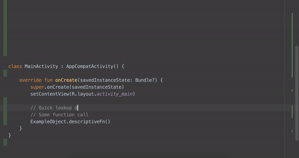
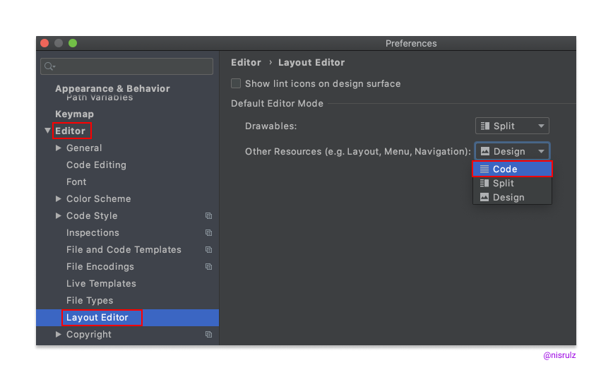

# Code faster by using keyboard shortcuts

| Description                                                                       | Mac                                                            | Linux/Win                                                                   |
|-----------------------------------------------------------------------------------|----------------------------------------------------------------|-----------------------------------------------------------------------------|
| Lookup IDE commands / Actions                                                     | <kbd>Cmd</kbd>&nbsp;<kbd>Shift</kbd>&nbsp;<kbd>A</kbd>         | <kbd>Ctrl</kbd>&nbsp;<kbd>Shift</kbd>&nbsp;<kbd>A</kbd>                     |
| Open Class                                                                        | <kbd>Cmd</kbd>&nbsp;<kbd>O</kbd>                               | <kbd>Ctrl</kbd>&nbsp;<kbd>O</kbd>                                           |
| Open File                                                                         | <kbd>Cmd</kbd>&nbsp;<kbd>Shift</kbd>&nbsp;<kbd>O</kbd>         | <kbd>Ctrl</kbd>&nbsp;<kbd>Shift</kbd>&nbsp;<kbd>N</kbd>                     |
| Open recently edited file                                                         | <kbd>Cmd</kbd>&nbsp;<kbd>Shift</kbd>&nbsp;<kbd>E</kbd>         | <kbd>Ctrl</kbd>&nbsp;<kbd>Shift</kbd>&nbsp;<kbd>E</kbd>                     |
| Open Symbol                                                                       | <kbd>Cmd</kbd>&nbsp;<kbd>Opt</kbd>&nbsp;<kbd>O</kbd>           | <kbd>Alt</kbd>&nbsp;<kbd>Shift</kbd>&nbsp;<kbd>N</kbd>                      |
| Open recently used file                                                           | <kbd>Cmd</kbd>&nbsp;<kbd>E</kbd>                               | <kbd>Ctrl</kbd>&nbsp;<kbd>E</kbd>                                           |
| Last Edited Location                                                              | <kbd>Cmd</kbd>&nbsp;<kbd>Shift</kbd>&nbsp;<kbd>Backspace</kbd> | <kbd>Ctrl</kbd>&nbsp;<kbd>Shift</kbd>&nbsp;<kbd>Backspace</kbd>             |
| Find Usage in persistent window                                                   | <kbd>Opt</kbd>&nbsp;<kbd>F7</kbd>                              | <kbd>Alt</kbd>&nbsp;<kbd>F7</kbd>                                           |
| Find Usage in floating window                                                     | <kbd>Cmd</kbd>&nbsp;<kbd>Opt</kbd>&nbsp;<kbd>F7</kbd>          | <kbd>Ctrl</kbd>&nbsp;<kbd>Alt</kbd>&nbsp;<kbd>F7</kbd>                      |
| Format the code with proper Indentation                                           | <kbd>Cmd</kbd>&nbsp;<kbd>Opt</kbd>&nbsp;<kbd>L</kbd>           | <kbd>Ctrl</kbd>&nbsp;<kbd>Alt</kbd>&nbsp;<kbd>L</kbd>                       |
| Surround With                                                                     | <kbd>Opt</kbd>&nbsp;<kbd>Cmd</kbd>&nbsp;<kbd>T</kbd>           | <kbd>Alt</kbd>&nbsp;<kbd>Ctrl</kbd>&nbsp;<kbd>T</kbd>                       |
| Open Terminal                                                                     | <kbd>Opt</kbd>&nbsp;<kbd>F12</kbd>                             | <kbd>Alt</kbd>&nbsp;<kbd>F12</kbd>                                          |
| Generate Setter/Getters                                                           | <kbd>Cmd</kbd>&nbsp;<kbd>N</kbd>                               | <kbd>Alt</kbd>&nbsp;<kbd>Ins</kbd>                                          |
| Find Class                                                                        | <kbd>CMD</kbd>&nbsp;<kbd>O</kbd>                               | <kbd>Ctrl</kbd>&nbsp;<kbd>N</kbd>                                           |
| Refactor/Rename                                                                   | <kbd>Shift</kbd>&nbsp;<kbd>F6</kbd>                            | <kbd>Shift</kbd>&nbsp;<kbd>F6</kbd>                                         |
| Quick Fix                                                                         | <kbd>Opt</kbd>&nbsp;<kbd>Enter</kbd>                           | <kbd>Alt</kbd>&nbsp;<kbd>Enter</kbd>                                        |
| Goto Definition                                                                   | <kbd>Cmd</kbd>&nbsp;<kbd>B</kbd>                               | <kbd>Ctrl</kbd>&nbsp;<kbd>B</kbd>                                           |
| Show parameters for selected method                                               | <kbd>Cmd</kbd>&nbsp;<kbd>P</kbd>                               | <kbd>Ctrl</kbd>&nbsp;<kbd>P</kbd>                                           |
| Refactor This                                                                     | <kbd>Ctrl</kbd>&nbsp;<kbd>T</kbd>                              | <kbd>Ctrl</kbd>&nbsp;<kbd>Alt</kbd>&nbsp;<kbd>Shift</kbd>&nbsp;<kbd>T</kbd> |
| Stop Process                                                                      | <kbd>Cmd</kbd>&nbsp;<kbd>F2</kbd>                              | <kbd>Ctrl</kbd>&nbsp;<kbd>F2</kbd>                                          |
| Search Everywhere                                                                 | <kbd>Shift</kbd>&nbsp;<kbd>Shift</kbd>                         | <kbd>Shift</kbd>&nbsp;<kbd>Shift</kbd>                                      |
| Select Methods to Override                                                        | <kbd>Ctrl</kbd>&nbsp;<kbd>O</kbd>                              | <kbd>Ctrl</kbd>&nbsp;<kbd>O</kbd>                                           |
| Delete Line                                                                       | <kbd>Cmd</kbd>&nbsp;<kbd>Backspace</kbd>                       | <kbd>Ctrl</kbd>&nbsp;<kbd>Y</kbd>                                           |
| Duplicate Line                                                                    | <kbd>Cmd</kbd>&nbsp;<kbd>D</kbd>                               | <kbd>Ctrl</kbd>&nbsp;<kbd>D</kbd>                                           |
| Grow/Shrink selection from cursor                                                 | <kbd>Opt</kbd>&nbsp;<kbd>Up/Down Arrow key</kbd>               | <kbd>Shift</kbd>&nbsp;<kbd>Ctrl</kbd>&nbsp;<kbd>W</kbd>                     |
| [Multicursor Selection](https://android.jlelse.eu/ctrl-g-d94c88cd4475#.55flqgkb3) | <kbd>Ctrl</kbd>&nbsp;<kbd>G</kbd>                              | <kbd>Alt</kbd>&nbsp;<kbd>J</kbd>                                            |

  **Complete Keymap Guide : [Linux/Win | MacOSX](https://resources.jetbrains.com/storage/products/intellij-idea/docs/IntelliJIDEA_ReferenceCard.pdf)**

### Other Tips/Tricks

- Did you know you can quickly lookup the definition of any function by navigating to the function call and using `Opt + Space` on macOS or `Alt + Space` on Win/Linux inside Android Studio🙀 [[Ref Tweet](https://twitter.com/nisrulz/status/1291115617651699712)]
  
    

- Annoyed by the Design view always opening up when you open a layout or drawable xml file?🙄Navigate to Preferences ▶️Editor ▶️Layout Editor and choose "Code" option, to always open in Code view. [[Ref Tweet](https://twitter.com/nisrulz/status/12908175832565678084)]

    

- If you want to use keyboard shortcuts with bookmarks, then make use of "Bookmark with Mnemonic". Once assigned a number, you can jump to the bookmark using `Ctrl + Number`. [[Ref Tweet](https://twitter.com/nisrulz/status/1293643013877637120)]

    

- When working with a class file dat has a lot of loc, often times one needs to jump between some parts of the same file. To do that, one can use the "Bookmarks" in Android Studio! Simply mark the line of code as Bookmark & open up the Bookmark Panel to jump. [[Ref Tweet](https://twitter.com/nisrulz/status/1293642003792748548)]

    

- Bunch of quick tips about refactoring under this [blogpost I wrote for raywenderlich.com](https://www.raywenderlich.com/2807578-android-studio-tips-and-tricks)
