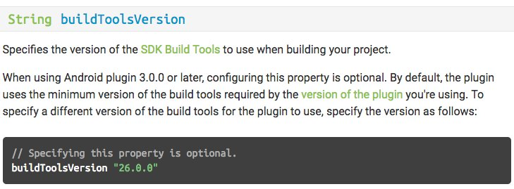
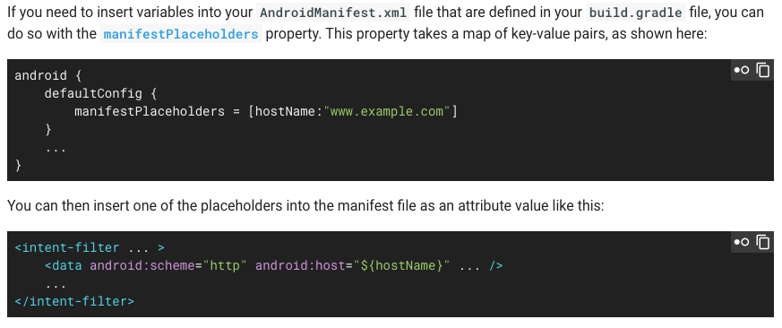

# Gradle: Groovy Script Tricks

* **Use proguard**

  ```groovy
  android {
    ...
    buildTypes {
        release {
            minifyEnabled true
            proguardFiles getDefaultProguardFile('proguard-android.txt'), 'proguard-rules.pro'
        }
    }
  }
  ```

  [[Read more from the manual here](https://www.guardsquare.com/en/proguard/manual/usage)]

* **Use shrinkResources**

  ```groovy
  android {
    ...
    buildTypes {
        release {
            shrinkResources true
            minifyEnabled true
            ...
        }
    }
  }
  ```

* **Split your apk using gradle when using Native code, do not bundle all of em together and ship!.. coz that will make you evil**

  ```groovy
  defaultConfig {
      ...

      ndk {
        abiFilters "armeabi", "armeabi-v7a", "mips", "x86"
      }
    }

  //Split into platform dependent APK
  splits {
    abi {
      enable true
      reset()
      include 'armeabi', 'armeabi-v7a', 'mips', 'x86' //select ABIs to build APKs for
      universalApk false //generate an additional APK that contains all the ABIs
    }
  }

  // map for the version code
  project.ext.versionCodes = ['armeabi': 1, 'armeabi-v7a': 2, 'mips': 5, 'x86': 8]

  // Rename with proper versioning
  android.applicationVariants.all { variant ->
    // assign different version code for each output
    variant.outputs.each { output ->
      output.versionCodeOverride =
          project.ext.versionCodes.get(output.getFilter(com.android.build.OutputFile.ABI), 0) *
              1000000 +
              android.defaultConfig.versionCode
    }
  }
  ```

* **To have the each subproject script name match that of the project name**

  Then add this line in settings.gradle

  ```groovy
  rootProject.children.each{
    it.buildFileName = it.name + '.gradle'
  }
  ```

* **Use different package name for non-release builds**

  ```groovy
    android {
        buildTypes {
            debug {
                applicationIdSuffix '.debug'
                versionNameSuffix '-DEBUG'
            }

            release {
                // ...
            }
        }
    }
  ```

* **Setup Android Studio to fail build if code contains `//STOPSHIP`** [[Ref Link]](https://www.reddit.com/r/androiddev/comments/5c8b0a/i_know_android_studio_allows_you_to_make_custom/d9uhdzt/)

  To enable the `//STOPSHIP` lint check, in your `build.gradle`

  ```groovy
  android {
  ...
      lintOptions {
          abortOnError true
          fatal 'StopShip'
      }
  }
  ```

  If you have a `//STOPSHIP` comment in your code, this will cause an error to be thrown when a release apk is generated.

  > You can turn on //STOPSHIP highlighting in Android Studio (isn't enabled by default) in
  >
  > `Preferences` > `Editor` > `Code Style` > `Inspections`.
  >
  > Search for STOPSHIP to find the correct setting.

* **Output unit tests directly to the console** [[Ref Link]](https://medium.com/@cesarmcferreira/mastering-the-terminal-side-of-android-development-e7520466c521#.1cw4bto7f)

  > A small neat trick to see Android unit tests logging results as they happen in the terminal.

  ```groovy
  android {
      ...
      testOptions.unitTests.all {
        testLogging {
          events 'passed', 'skipped', 'failed', 'standardOut', 'standardError'
          outputs.upToDateWhen { false }
          showStandardStreams = true
        }
      }
    }
  ```

* **Define a variable at build time**
  In your `build.gradle`

  ```groovy
  android{
    defaultConfig {
      ...
      buildConfigField "String", "SERVER_ENDPOINT", '"http://www.myendpoint.com"'
      buildConfigField "int", "FOO", "52"
      buildConfigField "boolean", "LOG", "false"
      ...
    }
  }
  ```

  and then use it in code as `BuildConfig.SERVER_ENDPOINT`, `BuildConfig.FOO`,`BuildConfig.LOG`

* **Calculate the version code and version name in your `build.gradle` **manually**_, based of version values_**
  In your app's `build.gradle`

  ```groovy
  versionMajor = 0
  versionMinor = 0
  versionPatch = 0
  versionBuild = 1

  verCode = versionMajor _ 1000000 + versionMinor _ 10000 + versionPatch \* 100 + versionBuild
  verName = "${versionMajor}.${versionMinor}.${versionPatch}"

  // Use
  android{
    defaultConfig {
          ...
          versionCode verCode
          versionName verName
          ...
    }
  }
  ```

- **Calculate the version code and version name in your `build.gradle` automatically, based on git information**

  > Note: These functions go specifically inside the app's `build.gradle` and cannot be used with `ext`.

  In your app's `build.gradle`

  ```groovy
  // Version code is calculated as the number of commits from last commit on master
  def getVersionCode = { ->
    try {
      def code = new ByteArrayOutputStream()
      exec {
        commandLine 'git', 'rev-list', 'HEAD', '--count'
        standardOutput = code
      }
      return Integer.parseInt(code.toString().trim())
    } catch (exception) {
      return "1";
    }
  }

  // Version name is Last Tag Name + No. of commits form last Tag +  short git sha
  def getVersionName = { ->
    try {
      def stdout = new ByteArrayOutputStream()
      exec {
        commandLine 'git', 'describe', '--tags', '--dirty'
        standardOutput = stdout
      }
      return stdout.toString().trim()
    } catch (exception) {
      return "0.0.0.1";
    }
  }

  // Use
  android{
    defaultConfig {
      ...
      versionCode getVersionCode()
      versionName getVersionName()
      ...
    }
  }
  ```

* **Get the date of build as a variable**
  In your app's `build.gradle`

  ```groovy
  // Get the date of build
  def getDateOfBuild = { -> // ISO 8601 time format
    return new Date().format("yyyy-MM-dd'T'HH:mm'Z'").toString().trim()
  }

  // then use it as a variable in BuildConfig
  android{
    defaultConfig {
      ...
      buildConfigField "String", "DATE_OF_BUILD", "\"${getDateOfBuild()}\""
    }
  }
  ```

* **Get the Git SHA as a variable**
  In your app's `build.gradle`

  ```groovy
  // Get the last Git Short Hash
  def getGitHash = { ->
    def stdout = new ByteArrayOutputStream()
    exec {
      commandLine 'git', 'rev-parse', '--short', 'HEAD'
      standardOutput = stdout
    }
    return stdout.toString().trim()
  }

  // then use it as a variable in BuildConfig
  android{
    defaultConfig {
      ...
      buildConfigField "String", "GIT_SHA", "\"${getGitHash()}\""
    }
  }
  ```

  > Have a look at the [Paperwork Project](https://github.com/zsoltk/paperwork), which generates build info for your Android project without breaking incremental compilation

* **[Use Java 8 features by adding `sourceCompatibility` & `targetCompatibility` to your build.gradle file](https://developer.android.com/studio/preview/features/java8-support.html)**

  ```groovy
  android {
    ...
    compileOptions {
      sourceCompatibility JavaVersion.VERSION_1_8
      targetCompatibility JavaVersion.VERSION_1_8
    }
  }
  ```

* **[Setup a gradle task to archive apks and proguard files on build, for backup purposes](https://medium.com/pressure-labs/a-new-devs-guide-to-google-play-sanity-4-a-groovy-script-to-save-them-all-456a12672886)**

  ```groovy
  task deployApks(type:Copy) {
      description = "Copies APKs and Proguard mappings to the deploy directory"
      def appName = "<app_name>";
      def versionDir = android.defaultConfig.versionName+"_"+android.defaultConfig.versionCode;

      println("Copies APK and Proguard to " + versionDir)

      from 'build/outputs/mapping/release/'
      include '**/mapping.txt'
      into '../.admin/deploy/' + versionDir
      rename ('mapping.txt', "${versionDir}-mapping.txt")

      from ('.') {
          exclude '**/build', '**/src'
      }

      include '*.apk'
      into '../.admin/deploy/' + versionDir
      rename ('app-release.apk', "${appName}-${versionDir}.apk")
  }
  ```

* **Reference local `aar` files as below [[Stackoverflow Ref](http://stackoverflow.com/a/28816265/2745762)]**

  ```groovy
    dependencies {
       implementation(name:'nameOfYourAARFileWithoutExtension', ext:'aar')
    }
    repositories {
       flatDir {
          dirs 'libs'
       }
    }
  ```

* Get faster gradle builds by only using one resource configuration for your development builds [[Ref Link](https://developer.android.com/studio/build/optimize-your-build#reduce_resources)]

  ```groovy
  android {
    ...
    productFlavors {
      dev {
        ...
        // The following configuration limits the "dev" flavor to using
        // English stringresources and xxhdpi screen-density resources.
        resConfigs "en", "xxhdpi"
      }
      ...
    }
  }
  ```

* Specifying `buildToolsVersion` in your build.gradle files is optional when using Android plugin 3.0.0 or later. By default the plugin uses the minimum version of the build tools required by the version of the plugin you're using. [[Tweet Link](https://twitter.com/nisrulz/status/976730548084211718), [Ref Link](https://google.github.io/android-gradle-dsl/current/com.android.build.gradle.LibraryExtension.html#com.android.build.gradle.LibraryExtension:buildToolsVersion)]

  

* You can insert variables into AndroidManifest defined in `build.gradle` [[Tweet Link](https://twitter.com/jabbar_jigariyo/status/910754663925899264), [Ref Link](https://developer.android.com/studio/build/manifest-build-variables)]

  

* **Make use of custom gradle tasks in your build.gradle files**

  Android uses Gradle as its build system, which actually allows one to make a lot of things easy by creating tasks to automate things.
  [This reddit post enlists a lot of such useful gradle scripts](https://www.reddit.com/r/androiddev/comments/3ig3gm/show_us_your_gradle_tasks)