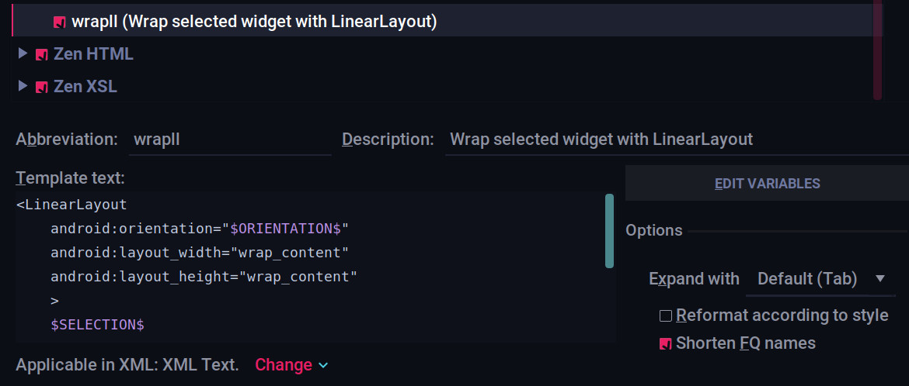
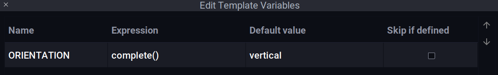

# Speed code using code-completion

## Use Live Templates in Android Studio
- `newInstance` - Generates the static `newInstance` function inside a Fragment
- `Toast` - Generates `Toast.makeText(context, "", Toast.LENGTH_SHORT).show();`
- `fbc` - findViewById with cast
- `const` - Define a android style int constant
- `logd` - Generates `Log.d(TAG, "");`
- `logm` - Log current method name and its arguments.
- `logr` - Log result of the current method
- `logt` - static logtaf with current classname
- `psf` - public static final
- `sout` - Prints a string to System.out
- `soutm` - Prints current class and method names to System.out
- `soutp` - Prints method parameter names and values to System.out
- `visible` - Set view visibility to VISIBLE
- `gone` - Set view visibility to GONE
- `noInstance` - private empty constructor to prohibit instance creation

- There is a quick way to surround your layout with a Linear Layout via using a Live Template. You can create one called `wrapll` by setting it up [[Ref Link](https://twitter.com/nisrulz/status/1197666095886454789)]

  
  

  ...and use it as below

  

  > You can create more based on your usecase 😄

[Comprehensive list of all Live Templates in Android Studio](https://github.com/keyboardsurfer/idea-live-templates)

## Postfix code completion in Android Studio

Android Studio/IntelliJ havea special kind of code completion which allows you to write code specific to a field

- `<expr>.null` will auto complete to `if(<expr> == null)`
- `<expr>.notnull` will auto complete to `if(<expr> != null)`
- `<expr>.var` will auto complete to `T name = <expr>`
- `<expr>.field` will auto complete to create a global field variable `field = <expr>`
- `<ArrayExpr>.for` will auto complete to `for(T item : <Arrayexpr>)`
- `<ArrayExpr>.fori` will auto complete to 

  `for(int i = 0; i < <Arrayexpr>.length; i++)`
- `<ArrayExpr>.forr` will auto complete to 
  
  `for(int i = <Arrayexpr>.length - 1; i > 0 ; i--)`

Complete list of available postfix code completion can be found via navigating inside Android Studio/IntelliJ menu:

**Settings → Editor → Postfix Templates**
